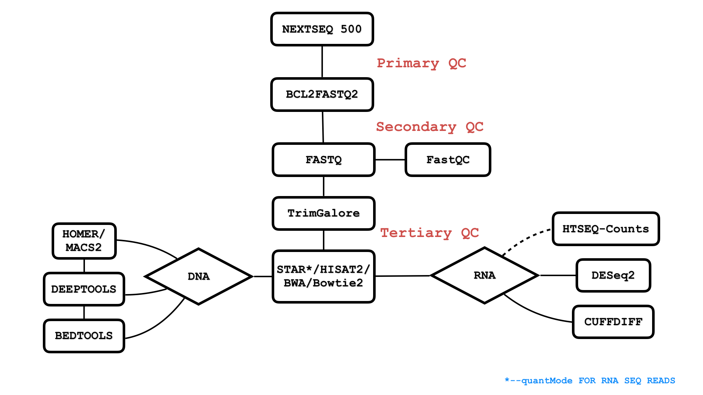

processSAR.R  -> Rscript processSAR.R <path/to/SAR/tables/> 

beta2.sh -> Current TRex workflow 

geneSwitch.R  -> For gff annotations use geneSwitch.R to replace the gene0, gene1, gene2 ... etc. 
naming schema with appropriate gene names
